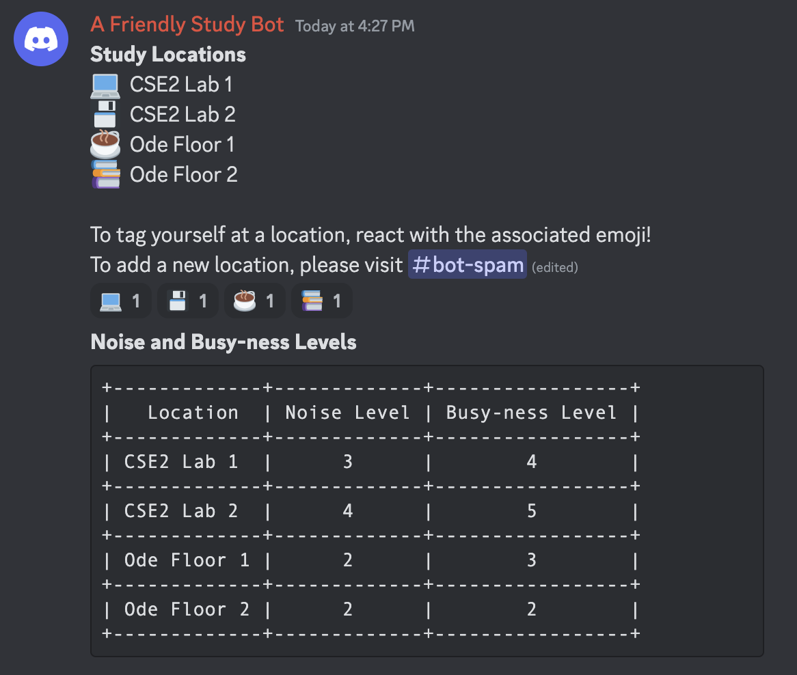
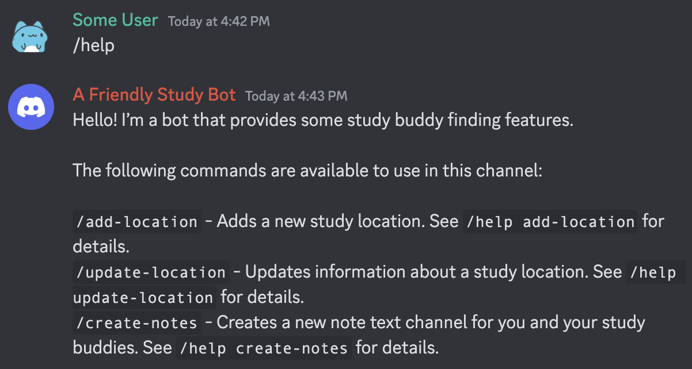
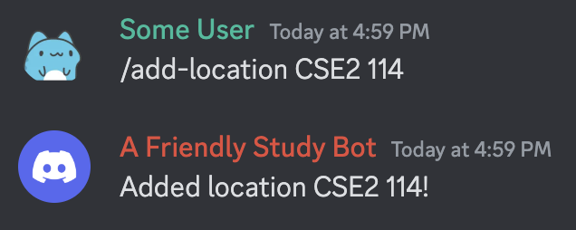
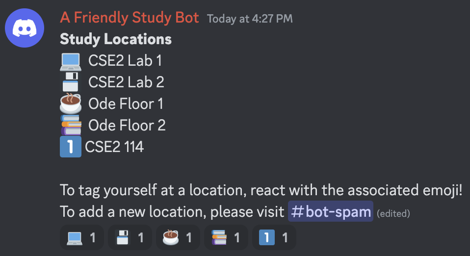
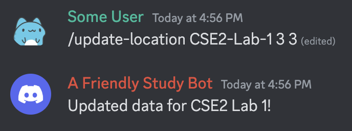
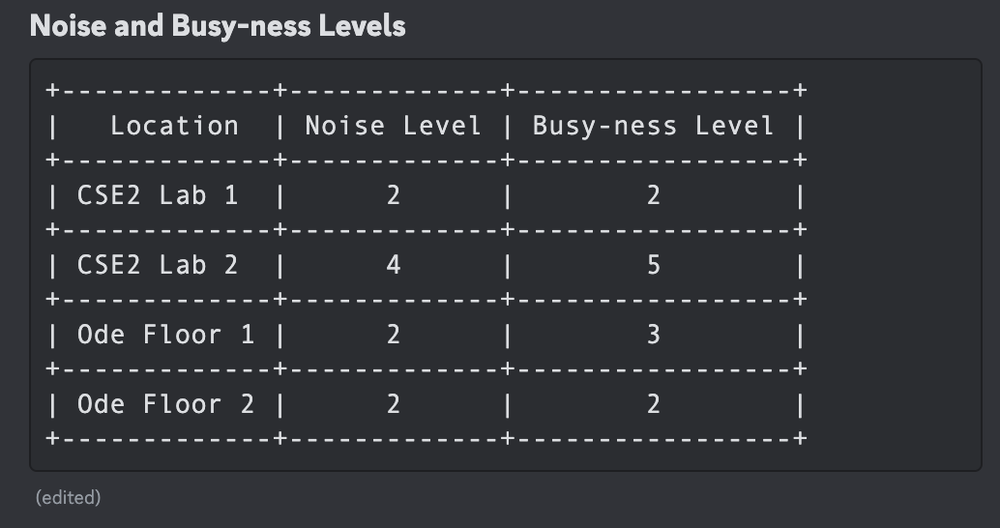
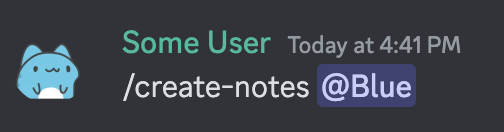

# Description of our Low-Fidelity Prototype

### What are the components?

Our low-fidelity prototype Discord study bot has several components. One component we incorporated with the help of some some ‘wizardry’ from the Wizard of Oz approach is giving users of the Discord server the ability to self-assign a preset location to indicate where they will be studying or to create a new study location, if none of the preset locations applies to them. Additionally, users will be able to provide some feedback on the quality of their study location (i.e. noise level and busy-ness level). Another component that we included was the ability for study groups to create a private text channel for collaborating and sharing notes.

### What are the parts that are ‘wizardry’?

In terms of the parts that are ‘wizardry’, there are a few potential study locations that we have currently set up with fake students, and this simulates students working at various locations across campus. This way, those who test our prototype can gain a sense of how the server will look when it is populated with actual students and their current study locations. We also have a table that contains dummy data that simulate insights which will be provided by students (noise level, busy-ness level) who are working at each of the study locations.

B - Screenshots of our Prototype
--------------------------------

Figures 1 and 2: Study bot displays information about various preset study locations and allows users to tag themselves at a location or to add a new location.

Figure 3: Users can use the /help command to receive information about what commands can be used with the bot.

Figures 4 and 5: Users can add a new study location with the /add-location command.

Figures 6 and 7: Users can update the noise and busy-ness levels of each location with the /update-location command.

Figures 8 and 9: Users can create text channels for their study group to send notes and resources.
