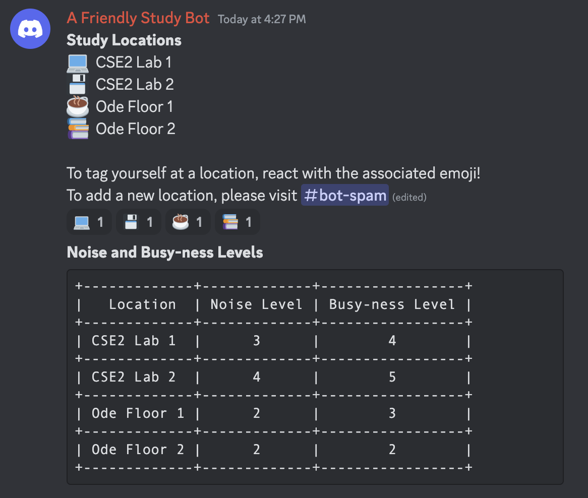
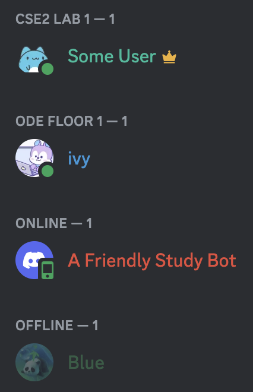
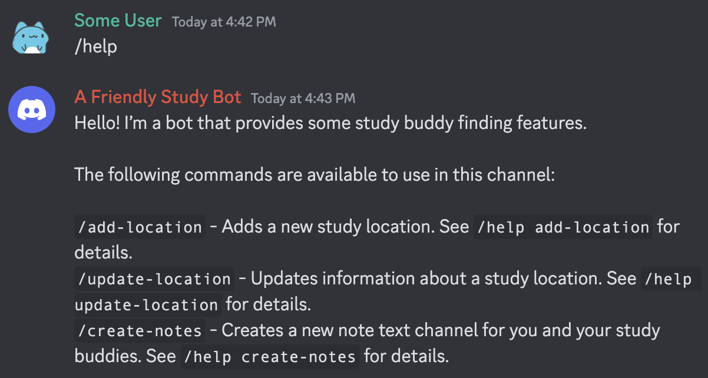
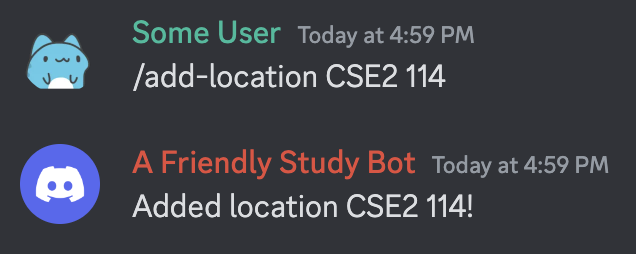
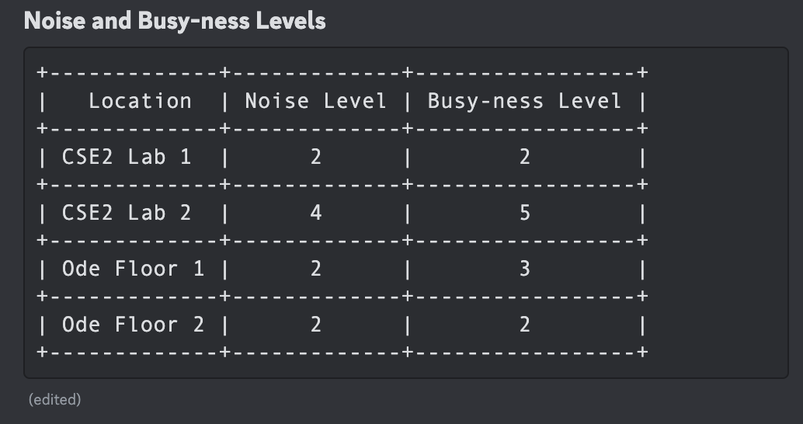
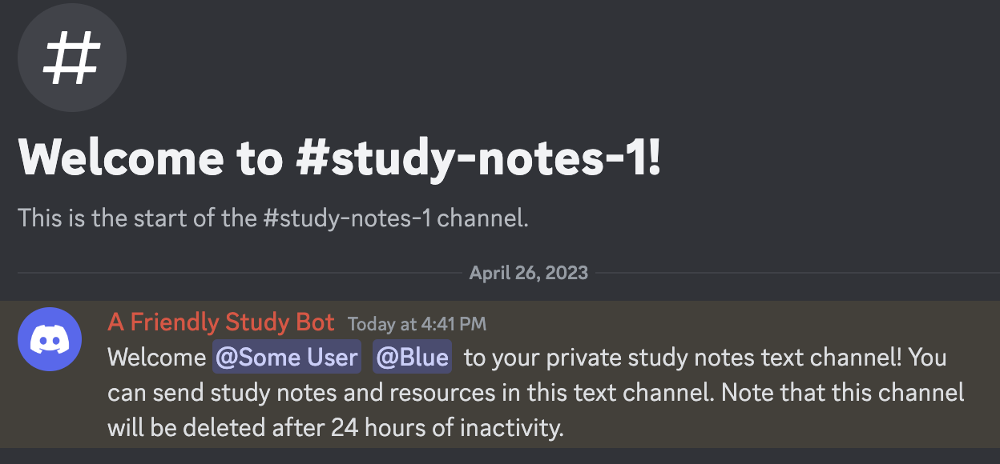

# Description of our Low-Fidelity Prototype

## What are the components?

Our low-fidelity prototype Discord study bot has several components. One component we incorporated with the help of some some ‘wizardry’ from the Wizard of Oz approach is giving users of the Discord server the ability to self-assign a preset location to indicate where they will be studying or to create a new study location, if none of the preset locations applies to them. Additionally, users will be able to provide some feedback on the quality of their study location (i.e. noise level and busy-ness level). Another component that we included was the ability for study groups to create a private text channel for collaborating and sharing notes.

## What are the parts that are ‘wizardry’?

In terms of the parts that are ‘wizardry’, there are a few potential study locations that we have currently set up with fake students, and this simulates students working at various locations across campus. This way, those who test our prototype can gain a sense of how the server will look when it is populated with actual students and their current study locations. We also have a table that contains dummy data that simulate insights which will be provided by students (noise level, busy-ness level) who are working at each of the study locations.

# B - Screenshots of our Prototype

                           |  
:-------------------------:|:-------------------------:
  |  

**Figures 1 and 2**: Study bot displays information about various preset study locations and allows users to tag themselves at a location or to add a new location.

**Figure 3**: Users can use the /help command to receive information about what commands can be used with the bot.

**Figures 4 and 5**: Users can add a new study location with the /add-location command.

**Figures 6 and 7**: Users can update the noise and busy-ness levels of each location with the /update-location command.

**Figures 8 and 9**: Users can create text channels for their study group to send notes and resources.

# Findings from User Testing

## What were your goals with this wizard of oz session: what did you want to learn and measure?

Our primary goal for the prototype feedback session was to determine whether our tool simplified the process of initiating study sessions (i.e., whether it was intuitive to perform the intended tasks of joining a study spot on campus, updating a particular study location, and creating a notes channel for a study group), and whether the tool would encourage students to participate in study sessions with others more often. We also wanted to figure out what specific situations a user will be motivated to use our tool and if they felt that there was adequate information provided to incentivize them to study with others. Furthermore, we wanted to ask our testers whether there were any additional features they would like to see that would encourage them to use our tool.

## What did you learn in the wizard of oz session?  

After having the users test out each of our intended tasks, we found there was slight confusion with some of our commands. For instance, the distinction between adding a new location, versus updating a location, could be made more clear. With this, the information provided in the help menu could be revised to be more specific.

Our user testing also revealed that our project is likely more applicable to lower-division courses where students are less likely to have a set group of peers to study with. Users were skeptical whether the bot would be useful for a class like CSE 481p, where groups are well-defined and there are no tests to study for. However, when answering questions from a perspective of what considerations they made when deciding where to study, they almost all agreed that noise and busy-ness levels were important metrics.

Additional features our users believed that could further enhance the experience could be the ability to view a list of other users in each study location, as well as a reset of users’ location data after a period of inactivity.

## Are the findings promising enough that you would like to go ahead with the project? (If yes, describe why, if no, describe what changes you are proposing to make.) 

With the aforementioned findings in mind, we believe that our project is practical and would like to proceed with our project. Our user testing revealed that the core functionality of our project is helpful for students to find others to study with and decide where to study. Furthermore, we still believe that Discord is the best platform to design our tool for, as almost all courses have a dedicated Discord server such that integrating our tool into existing or new servers would be very easy, making it more likely for our bot to be adopted by students.

## What elements will you keep in your next iteration of the design? 

Based on the feedback from our user testing, we will keep most of our project’s current design in our next iteration, as our testers found most of the features helpful for finding others to study with and deciding where to study. Specifically, these components include (1) the ability to add locations and tag oneself at a location and (2) the ability to view and update information about a location’s noise and busy-ness levels. 

We did not receive any explicit feedback about the study group notes feature, so we will keep it for our next iteration but may remove it if future user testing reveals that it is not useful or necessary.
What elements do you need to revise? Why?
As mentioned above, we plan to revise our /help command to provide more specific information about each command and its usage to reduce user confusion when first learning how to use our bot. With this change in mind, we also plan to retool our bot’s responses and interface toward a more focused target user group of students in lower-division courses, as our testing revealed that our project may not be as applicable for smaller upper-division courses. 

We also plan on implementing a couple of new features, including (1)  the ability to view a list of other users in each study location in addition to the users sidebar in a server and (2) the resetting of users’ location tag after a set amount of time has passed and they have not responded to the bot’s message asking if they are still at a location. The first feature is important because some discord users set their status as offline or have their devices turned off even if they are at a study location. The second feature is important because outdated location data for users could be detrimental to our tool’s functionality, as users would be disappointed if they wanted to study with someone but no one was there when they showed up. 
