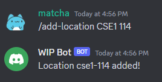
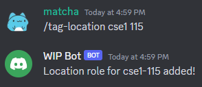
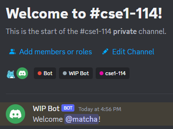
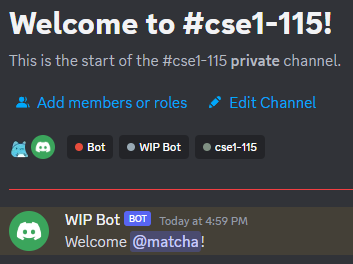

# User Testing

## Description of Our Medium-Fidelity Prototype
The two functionalities that we implemented are the `/add-location` and `/tag-location` commands. `/add-location` is used to create a new study location, tag the user at the new study location, and create a text-channel for communication with other users who may also be at the same location. `/tag-location` is used to get a location role from the bot to view and send messages in the private text channel for a location. You can find the implementation of our bot’s commands in the bot.py file, found in the top-level directory of our repository. The issues that correspond to the two functionalities that we implemented are the “Implement add_location functionality” and “Implement tag_location functionality” issues, which can be found under the closed Issues section of our repository.

These functionalities work as stand-alone commands, so we omitted all other functionalities for this user testing process.

## Screenshots of our Prototype

_**Figure 1**: The A user adds a location using the `/add-location` command and our bot confirms the addition of the location._

_**Figure 2**: The bot creates a new private text channel for the location, a role with permissions to view and send messages in that text channel, and welcomes the user who added the location._

_**Figure 3**:A user tags themselves at a location using the `/tag-location` command and receives the role with permissions to view and send messages in that location’s private text channel._

_**Figure 4**: The bot welcomes the user who tagged themselves at the location._

## Findings From our User Testing Sessions
### What did you learn from the user testing session?
We conducted four user tests with our peers in the capstone course. In our user tests, we had users try out the two functionalities of adding a new study location on campus and tagging/assigning themselves to a particular study location. We learned that without guidance, the process of getting started was not too intuitive (i.e., trying to find the specific channel that you were supposed to communicate with the study bot, and which commands to start with). Despite the initial confusion, some testers looked at previous chatbot activity to determine which commands to get started with in order to add and join a particular study location and were guided by the bot’s error messages along the way. Although our testers agreed that the bot’s error messages were helpful, some suggested that an introductory message be displayed when they first join the server or open the study bot, that includes a guide on how to get started, all of the commands that are available, and the formatting of parameters.

Another common pattern we discovered during our user tests was the uncertainty with what the tagged roles indicated (‘tagging’ seems like Discord lingo). They suggested adjustments to this language to make it more clear that the user is joining/assigning themselves to a specific study location.

While completing these two tasks, there were also a few unique suggestions provided by our testers, one of which included the ability to update/downgrade their assigned roles between read/write and read-only when leaving or changing study locations. This would give the user the ability to join a new study location while still having access to a previous channel they were in. As long as a location channel at had least one user with its respective role, the text channel would not be deleted by the bot. Another tester suggested the automatic creation of a study location if one attempted to tag themselves at a study location that does not already exist, as opposed to our current structure of having to manually create the location and tag themselves again. This saves a step and provides a smoother experience. Lastly, one of our testers also stressed the importance of privacy and was concerned with the fact that students would be able to view the entire chat history of those who were previously in the same study room they were joining. 

### Are the findings promising enough that you would like to go ahead with the current functionality of the prototype? (If yes, describe why, if no, describe what changes you are proposing to make.)
As we found previously that users emphasized the importance of noise levels and the crowdedness of a space when choosing a location to study, the primary functionalities that we aim to implement next include listing this information to a user and allowing users to update these levels. Other primary functionalities include the ability to clear/update roles when leaving or moving between study locations.

### What are the next functionalities that you will implement in your prototype?
As we found previously that users emphasized the importance of noise levels and the crowdedness of a space when choosing a location to study, the primary functionalities that we aim to implement next include listing this information to a user and allowing users to update these levels. Other primary functionalities include the ability to clear/update roles when leaving or moving between study locations.

Additionally, based on the feedback/suggestions we received during our user tests on the current functionalities we have implemented, we determined that the following features could be added, adjusted, or improved to address the concerns of our users:
- An introductory/welcome message from the bot so that when a user first joins the server, they have all the tools needed to locate the bot and get started with commands.
- If a user attempts to tag themselves at a study location/room that is not already registered, then it should be automatically created to save a step.
- Use a pre-set list of designated study buildings/locations/rooms (rather than allowing users to specify these) to prevent the addition of nonexistent campus locations.
- Allow the ability for users to change/downgrade roles when they move between study locations. 
  -This gives users the option to leave or stay in the previous channel for a study location, so they can continue to have channel access if they need.
-Set an expiration time (~24 hours) on study channels to protect the privacy of previous students who were in the room.

Secondary functionalities would include the ability to list the current users at a location and to set a capacity and duration of a particular session. Setting a capacity could help improve the focus of study groups, as groups tend to become less productive after reaching a certain size. Likewise, setting the duration of a particular session could help users scope out how much work they plan to accomplish during the study session. Overall, these features would help to encourage and incentive the formation of study groups.
