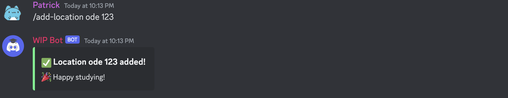
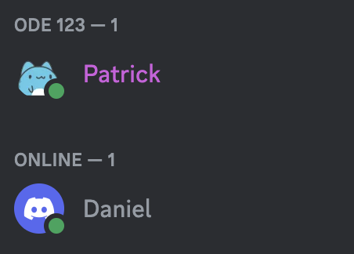
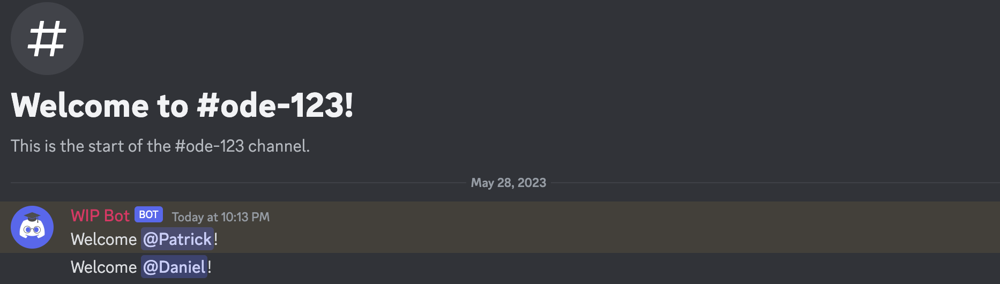
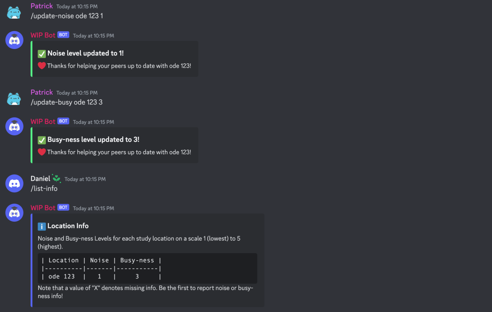
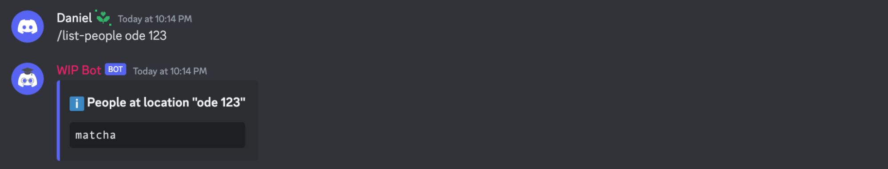
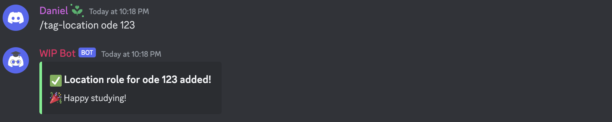
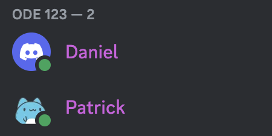
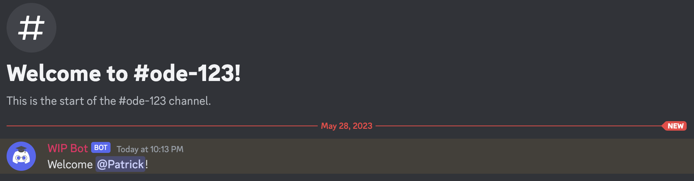
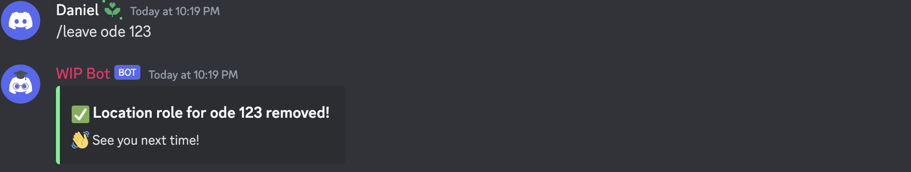
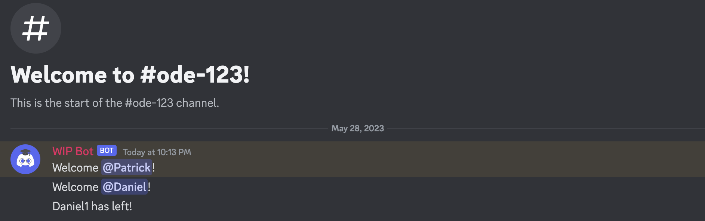

# G7: Digital Prototype
## Our Problem Space
Working on campus can be an isolating and unpleasant experience. From our initial round of user research, we found that students in lower division courses tend to be very willing to work with others but find that the level of effort required to initiate study sessions with others is too daunting. We also discovered that students reported being willing to work with their peers taking the same courses or even the same department. With this in mind, our project aims to improve the process of finding study partners and suitable study locations for each individual’s preferences in order to foster collaboration between students and make studying a more enjoyable activity. Our target audience is students in introductory-level courses at the University of Washington because introductory-level classes have hundreds of students enrolled in a single class and this makes finding and collaborating with other students very difficult.

## Our Solution
Our solution to this problem is a Discord bot that helps facilitate collaboration between peers! We learned through our initial user research that many introductory-level courses have course-specific Discord servers, so our bot aims to leverage the existing platform and communities to achieve our project’s goals. WIP Bot helps with two main tasks: (1) finding other students to study with and (2) finding ideal study locations. With WIP Bot, users can add and tag themselves at specific locations on campus so that other students in the server can see where their peers are studying. Users can also report important information about each location, such as the noise and busy-ness level, so that other students can know which locations are suitable for their studying or collaborating needs. Currently, our Discord bot is hosted locally by a user, but we’re looking into the possibility of hosting it on Heroku or AWS. Our bot is implemented in Python using the `discord.py` library.

## Our Design Process
Firstly, we implemented the primary functionalities of adding/tagging/clearing study location roles, and listing information (noise and busy-ness levels) about study locations which users can update. We ensured that we addressed possible edge cases and had appropriate error handling for these main functionalities before moving over to secondary functionalities. The secondary functionalities we were able to finish implementing include the ability to list people at study locations and overwriting location roles.

Because of the tight timeline for this project, we were limited to implementing the most important functionalities that we identified in our code and design specification. We originally envisioned location roles to last for a predetermined length of time (set by the user) so that users would not have to manually remove a location role. Furthermore, we also wanted to implement a matching algorithm to match students in the same location. This feature would be opt-in and would be a fun way for students to interact with a larger group of their peers in a course. Lastly, we had also planned to log historical location information so users could look to see how noisy and busy a location was in the past, even if the information hadn’t been updated by another user recently.

## Try Our Bot!
You can find the code for our Discord bot at our [GitHub repository](https://github.com/UWSocialComputing/wip-code). From there, you can follow the instructions in our `README` file to host our bot on your server! Note that we are currently looking into hosting options so that our bot is easier to access.

## Prototype Documentation

_**Figures 1, 2, & 3**: A user adds themselves to a room in the Odegaard library using the `/add-location` command, receiving the location role and being added to the private location text channel._

_**Figure 4**: A user updates the noise and busy-ness levels for a room in the Odegaard library using the `/update-noise` and `/update-busy` commands, then other users are able to view that information using the `/list-info` command._

_**Figure 5**: A user asks the bot to list the students in room 123 of the Odegaard library using the `/list-people` command._

_**Figures 6, 7, & 8**: Another user decides to join room 123 of the Odegaard library using the `/tag-location` command, receiving the location role and being added to the private location text channel._

_**Figures 9 & 10**: A user decides to leave room 123 of the Odegaard library using the `/leave command`, so the bot removes the location role and notifies the text channel that the user has left._